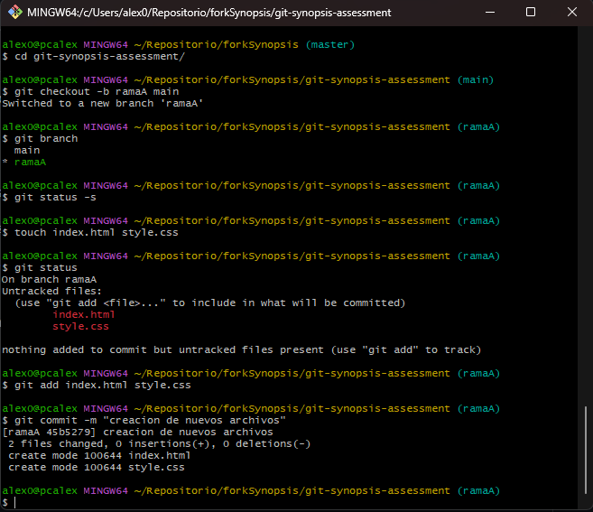

# Solución

## Actividad 1

1. Genere una nueva rama A en base a main y agregar los ficheros que considere necesarios. (.js | .ts | .java | .cs | .html | etc).

    

2. Restringir del historial de cambios a las carpetas /bin /node_modules y /target.

    
    
   
3. Generar 2 carpetas cualquiera sin contenido que sean incluidas en el historial de cambios.

    
   
4. Generar otra rama B para realizar nuevas modificaciones y luego integrar estos en la rama A.

    
   
5. Integrar SOLO el commit con nombre "FIX: issue 2" de la rama hotfix/main en la rama A.

    

6. Ejemplifique el uso de git para la modificación de ficheros en la rama A y en la rama B simultaneamente sin generar commits en el historial de cambios.
   
   
   
   
   
8. Ejemplifique el uso de git para la generación y publicación de un nuevo release (versión) de su código.
    
    
